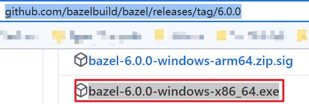
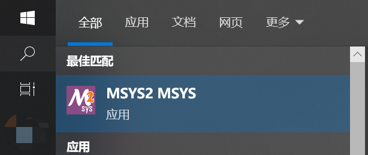
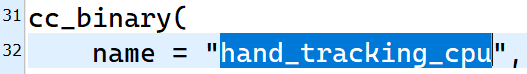
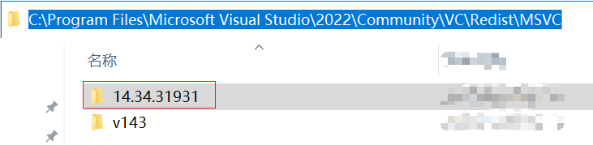
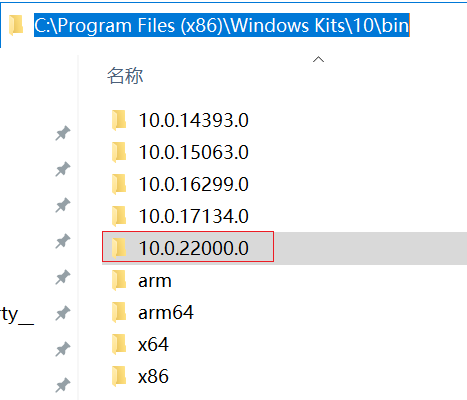
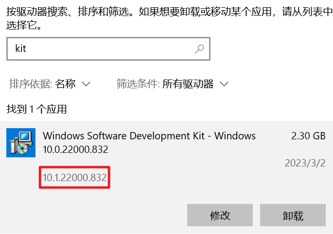

# 编译mediapipe

## 安装python

将其目录添加到系统环境变量Path中。

`C:\Users\daniate\AppData\Local\Programs\Python\Python39`

## 安装pip

下载[get-pip.py](https://bootstrap.pypa.io/get-pip.py)（已保存在`mediapipe`目录中）

在`cmd`或`PowerShell`中操作：

```
python get-pip.py
```

将python的`Scripts`目录添加到系统环境变量Path中。

安装`numpy`、`tensorflow`：

```shell
pip install numpy
pip install tensorflow
```

## 安装bazel

下载`bazel`[bazel 6.0.0](https://github.com/bazelbuild/bazel/releases/tag/6.0.0)，并重命名为`bazel.exe`。



将其放置到系统环境变量Path的某个目录中，比如`C:\Windows\System32`。

或者将其所在目录添加到系统环境变量Path中。

## 安装`MSYS2`

[MSYS2](https://www.msys2.org/)

## 编译

关于选择使用哪个版本的`Visual Studio`：[4060#issuecomment-1445180001](https://github.com/google/mediapipe/issues/4060#issuecomment-1445180001)

在`MSYS2 MSYS`中操作，也可以在`PowerShell`中操作：



```shell
# 设置变量 VS 2019（按官方文档来，使用其他版本的VS可能会出错）
set BAZEL_VS="C:\Program Files (x86)\Microsoft Visual Studio\2019\Community"
set BAZEL_VC="C:\Program Files (x86)\Microsoft Visual Studio\2019\Community\VC"
set BAZEL_VC_FULL_VERSION=14.29.30133
set BAZEL_WINSDK_FULL_VERSION=10.0.19041.685
# 切换到 mediapipe 目录后
# 编译 face_mesh_cpu
bazel --host_jvm_args "-DsocksProxyHost=127.0.0.1" --host_jvm_args "-DsocksProxyPort=10808" build -c opt --define MEDIAPIPE_DISABLE_GPU=1 --action_env PYTHON_BIN_PATH="C:/Users/daniate/AppData/Local/Programs/Python/Python39/python.exe" mediapipe/examples/desktop/face_mesh:face_mesh_cpu
# 运行 face_mesh_cpu
.\bazel-bin\mediapipe\examples\desktop\face_mesh\face_mesh_cpu.exe --calculator_graph_config_file=.\mediapipe\graphs\face_mesh\face_mesh_desktop_live.pbtxt
# 编译 hand_tracking_cpu
 bazel --host_jvm_args "-DsocksProxyHost=127.0.0.1" --host_jvm_args "-DsocksProxyPort=10808" build -c opt --define MEDIAPIPE_DISABLE_GPU=1 --action_env PYTHON_BIN_PATH="C:/Users/daniate/AppData/Local/Programs/Python/Python39/python.exe" mediapipe/examples/desktop/hand_tracking:hand_tracking_cpu
# 运行 hand_tracking_cpu
.\bazel-bin\mediapipe\examples\desktop\hand_tracking\hand_tracking_cpu.exe --calculator_graph_config_file=.\mediapipe\graphs\hand_tracking\hand_tracking_desktop_live.pbtxt
# 编译 hair_segmentation_cpu
bazel --host_jvm_args "-DsocksProxyHost=127.0.0.1" --host_jvm_args "-DsocksProxyPort=10808" build -c opt --define MEDIAPIPE_DISABLE_GPU=1 --action_env PYTHON_BIN_PATH="C:/Users/daniate/AppData/Local/Programs/Python/Python39/python.exe" mediapipe/examples/desktop/hair_segmentation:hair_segmentation_cpu
# 运行 hair_segmentation_cpu
.\bazel-bin\mediapipe\examples\desktop\hair_segmentation\hair_segmentation_cpu.exe --calculator_graph_config_file=.\mediapipe\graphs\hair_segmentation\hair_segmentation_desktop_live.pbtxt
```

上方的`face_mesh_cpu`、`hand_tracking_cpu`、`hair_segmentation_cpu`从哪里获得，以`hand_tracking_cpu`为例：

查看`mediapipe\examples\desktop\hand_tracking\BUILD`文件，使用`cc_binary`中的`name`。



`BAZEL_VC_FULL_VERSION`：



`BAZEL_WINSDK_FULL_VERSION`：





关于设置代理的问题（`--host_jvm_args`）：[581#issuecomment-683305892](https://github.com/google/mediapipe/issues/581#issuecomment-683305892)

找不到`OpenCV`相关`dll`的问题：[1926#issuecomment-825874197](https://github.com/google/mediapipe/issues/1926#issuecomment-825874197)

## 参考资料

1. [Bazel 使用 MSVC 构建 C++](https://bazel.build/configure/windows?hl=zh-cn#build_cpp)
2. [Mediapipe Installing on Windows](https://developers.google.com/mediapipe/framework/getting_started/install#installing_on_windows)
3. [https://stubbornhuang.blog.csdn.net/article/details/119546019](https://stubbornhuang.blog.csdn.net/article/details/119546019)
